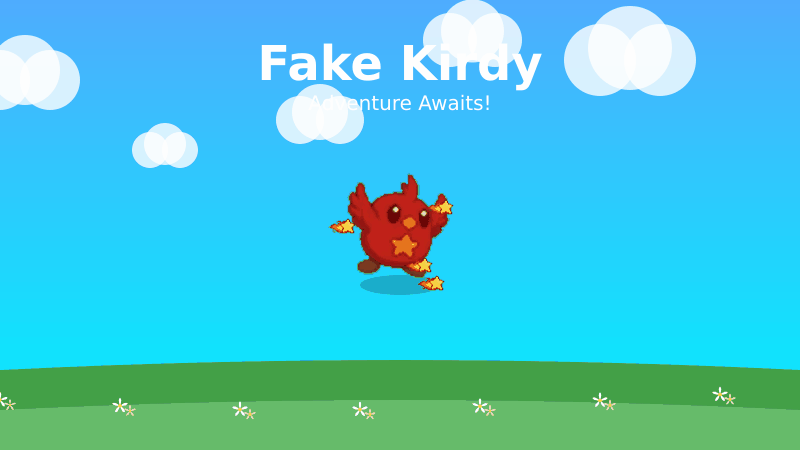

# fake-kirdy

Fake Kirdy uses Godot 4 as the canonical runtime. The former Phaser + Matter.js reference copy has been removed from the repository after its gameplay intent, topology, and asset evidence were migrated into Godot-owned data.

## Godot Mainline

- Run the canonical Godot project: `npm run dev` or `npm run godot:run`
- Run a headless replay when Godot is installed: `npm run godot:replay`
- Export the canonical Godot Web build when export templates are installed: `npm run build` or `npm run godot:export`
- Build the required public GitHub Pages artifact: `npm run build:public`
- Summarize a trace file: `npm run trace:summary -- <trace.json|trace.ndjson>`
- Validate the repository: `npm test`
- Validate canonical Godot behavior, including the replay suite when available: `npm run test:canonical`
- Check the Phaser-to-Godot parity ledger: `npm run godot:parity-ledger -- --check`

The canonical Godot project lives in `godot/`. The default export preset is `Web` and writes the public artifact to `dist/index.html`; the `Linux Headless` preset remains available through `npm run godot:export -- --preset="Linux Headless"`. The regular export wrapper skips gracefully if Godot or export templates are unavailable, while `npm run build:public` requires a complete Godot Web export for deployment. The promoted Godot prototype tree has been removed; use `godot/` for all runtime, replay, export, and content work.

## Legacy Removal

GitHub Pages publishes the Godot Web export from `dist/`. Phaser/Vite publishing is no longer part of the project.

The root package no longer exposes Phaser/Vite runtime commands or dependencies, and the legacy reference copy has been removed. Use Godot commands for run/build/test.

Run `npm run legacy:inventory` to confirm the removed legacy surface remains empty. Run `npm run godot:parity-ledger -- --fail-on-blockers` before changing that boundary again.
