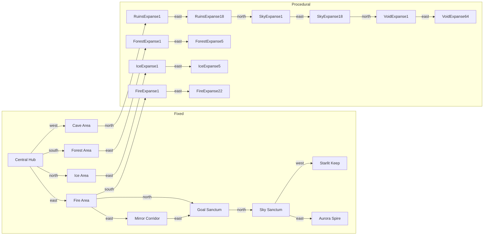

# マップ構成概要

## 固定マップ
| 表示名 | エリアID | 主な役割 | 隣接エリア |
| --- | --- | --- | --- |
| Central Hub | central-hub | ゲーム開始地点。各方向に基幹エリアを接続 | 北: Ice Area / 東: Fire Area / 南: Forest Area / 西: Cave Area |
| Mirror Corridor | mirror-corridor | ハブ東側の細長い通路。Fire への入口 | 西: Central Hub / 東: Fire Area |
| Ice Area | ice-area | 北方エリア。ハブ北ドアと接続し、Ice Expanse の入口を提供 | 南: Central Hub / 東: Ice Expanse 入口 |
| Forest Area | forest-area | ハブ南口。Forest Expanse サイドルートへの入口 | 北: Central Hub / 東: Labyrinth-001 |
| Cave Area | cave-area | ハブ西口。Ruins Expanse メインラインへの入口 | 東: Central Hub / 北: Ruins Expanse 入口 |
| Fire Area | fire-area | Fire クラスタ入口。Goal Sanctum や Fire Expanse への分岐を束ねる | 西: Central Hub / 東: Mirror Corridor / 北: Goal Sanctum / 南: Fire Expanse 入口 |
| Mirror Corridor | mirror-corridor | Fire Area から Goal Sanctum へ向かう細長い回廊 | 西: Fire Area / 東: Goal Sanctum |
| Goal Sanctum | goal-sanctum | ゴール判定とスコア集計 | 南: Fire Area / 北: Sky Sanctum |
| Sky Sanctum | sky-sanctum | 空中分岐ハブ | 南: Goal Sanctum / 東: Aurora Spire / 西: Starlit Keep |
| Aurora Spire | aurora-spire | 垂直タワー | 西: Sky Sanctum |
| Starlit Keep | starlit-keep | 水平要塞 | 東: Sky Sanctum |

## 手続き生成マップ
`src/game/world/stages/procedural.ts` の `CLUSTERS` でクラスタごとの生成数と難易度を管理しています（2025-11-17 時点）。

| クラスタ | 生成数 | 表示名パターン | 難易度 | 接続の特徴 |
| --- | --- | --- | --- | --- |
| forest | 5 | Forest Expanse 1〜5 | 2 | Forest Area 東隣から一直線に生成。北方向とは接続せず、探索用の支線として機能する。 |
| ice | 5 | Ice Expanse 1〜5 | 3 | Ice Area 東側と直接接続する支線。Ice Expanse から他クラスタへは接続せず、入口は Ice Area のみ。 |
| fire | 22 | Fire Expanse 1〜22 | 3 | Fire Area 南から侵入する支線。内部は西⇔東に連結し、他クラスタとは直接接続しない。 |
| ruins | 18 | Ruins Expanse 1〜18 | 2 | Cave Area から直接侵入し、クラスタ内の東西連結を辿って最後のノードが Sky クラスタへ接続。Fire クラスタとは分離。 |
| sky | 18 | Sky Expanse 1〜18 | 4 | ruins クラスタ北側に接続。 |
| void | 64 | Void Expanse 1〜64 | 1 | sky 最終ノードの北側。Forest/Ice を削減した分をここで補い、全体で 132 面を維持。 |

### 接続ルール
1. 各クラスタは内部で西⇔東に線形接続されます。`clusterNodes[index].neighbors` により、前ノードは東方向、次ノードは西方向で互いを参照します。
2. 異なるクラスタ間は原則として「前クラスタ最終ノード」と「次クラスタ先頭ノード」を南⇔北で接続しますが、Ice / Fire / Ruins クラスタはそれぞれ Ice Area / Fire Area / Cave Area から分岐するため、前クラスタとは繋がりません。
3. 最初のノード (`labyrinth-001`) の西隣には `forest-area` を、Ice クラスタ先頭ノードの西隣には `ice-area` を、Fire クラスタ先頭ノードの南隣には `fire-area` を、Ruins クラスタ先頭ノードの南隣には `cave-area` を接続し、それぞれの入口を明確化しています。
4. 各生成エリアには共通レイアウト幅 18×12（タイルサイズ 32px）、共通エントリポイント、デッドエンド報酬（health / max-health / revive）が付与され、`MapSystem.scatterDeadEndHeals` と `MapOverlay` の探索情報に活用されます。

## 名称一意性とデバッグ
- `AreaManager` では `ensureUniqueAreaNames` を通じて、同名ステージが存在する場合でも `(2)` `(3)`...のサフィックスを付与して HUD やログ表示の重複を避けています。
- HUD 右側には現在のマップ名を常時表示するため、上記一覧と組み合わせてデバッグ用にエリア遷移を追跡できます。

## 接続イメージ (Mermaid)

