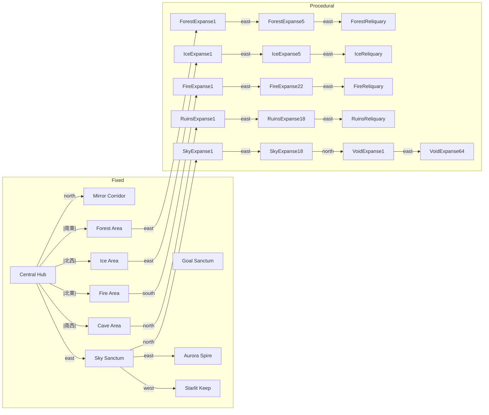

# マップ構成概要

## 固定マップ
| 表示名 | エリアID | 主な役割 | 隣接エリア |
| --- | --- | --- | --- |
| Central Hub | central-hub | ゲーム開始地点。各方向に基幹エリアを接続 | 北: Mirror Corridor / 東: Sky Sanctum（ハイエンド） / 北西: Ice Area / 北東: Fire Area / 南東: Forest Area / 南西: Cave Area |
| Ice Area | ice-area | 北方エリア。ハブ北西角ルートと接続し、Ice Expanse の入口を提供 | 南東: Central Hub / 東: Ice Expanse 入口 |
| Forest Area | forest-area | ハブ南東角ルート。Forest Expanse サイドルートへの入口 | 北西: Central Hub / 東: Labyrinth-001 |
| Cave Area | cave-area | ハブ南西角ルート。Ruins Expanse メインラインへの入口 | 北東: Central Hub / 北: Ruins Expanse 入口 |
| Fire Area | fire-area | Fire クラスタ入口。Goal Sanctum から切り離され、Fire Expanse へのゲートのみ維持 | 南西: Central Hub / 南: Fire Expanse 入口 |
| Mirror Corridor | mirror-corridor | Central Hub 北扉から侵入するゴール前通路。Goal Sanctum への侵入を制御 | 南: Central Hub / 北: Goal Sanctum |
| Goal Sanctum | goal-sanctum | ゴール判定とスコア集計 | 南: Mirror Corridor（リザルト専用扉） / 北: なし |
| Sky Sanctum | sky-sanctum | 空中分岐ハブ（ハイエンド入口） | 南: Central Hub / 東: Aurora Spire / 西: Starlit Keep / 北: Sky Expanse 1 |
| Aurora Spire | aurora-spire | 垂直タワー | 西: Sky Sanctum |
| Starlit Keep | starlit-keep | 水平要塞 | 東: Sky Sanctum |
| Forest Reliquary | forest-reliquary | Forest Expanse 終端の儀式場。森林ルートの最終試練として keystone を守る | 西: Forest Expanse 5 |
| Ice Reliquary | ice-reliquary | Ice Expanse 終端の氷柱神殿。滑走床と狭い足場で keystone を保護 | 西: Ice Expanse 5 |
| Fire Reliquary | fire-reliquary | Fire Expanse 終端の溶岩祭壇。火炎トラップと連続足場で侵入を制限 | 西: Fire Expanse 22 |
| Ruins Reliquary | ruins-reliquary | Ruins Expanse 終端の封印空間。keystone 保管庫として完結 | 西: Ruins Expanse 18 |

中央ハブの出入口は北西・北東・南西・南東に加え、北向き Mirror Corridor と東向き Sky Sanctum の 2 本の幹線扉を持ちます。ハイエンド用の東扉は Mirror Corridor と同じ Keystone ロックを共有し、既存ルートに干渉せず高難度帯へアクセスできます。

また、Forest / Ice / Fire / Cave（Ruins）ブランチの終端には固定リリクアリ（`forest-reliquary` / `ice-reliquary` / `fire-reliquary` / `ruins-reliquary`）を新設し、それぞれに「Keystone」系の遺物（`forest-keystone` / `ice-keystone` / `fire-keystone` / `cave-keystone`）を配置しました。これらをすべて集めるまで Central Hub の北扉（Mirror Corridor 側）と東扉（Sky Sanctum 側）はロックされたままで、両ルートとも開放されません。

Goal Sanctum 北壁の Sky 連絡扉は撤去し、南側の入口扉を `goal-door` としてリザルト演出専用の閉じた空間として扱います。Sky クラスタへの遷移は Central Hub のハイエンドゲート経由に限定し、ゴール進行と高難度探索を明確に分離しました。

### Sky Sanctum 拡張ステージ詳細

`central-hub` 東扉（ハイエンド）から接続する天空遺跡帯は 3+α ステージ構成で、ホバリング・縦移動ギミックを中心に難易度を引き上げる。Sky Expanse と Void Expanse はこの帯の北端から続くエンドゲーム向けの連続挑戦区間となる。

| ステージ ID | 表示名 | 接続 | 主な敵 | ギミック概要 |
| --- | --- | --- | --- | --- |
| `sky-sanctum` | Sky Sanctum | 南: central-hub（ハイエンド扉） / 東: aurora-spire / 西: starlit-keep / 北: sky-expanse-1 | Frost Wabble, Glacio Durt | 浮遊足場と中央気流で縦移動を生むホバリング導線 |
| `aurora-spire` | Aurora Spire | 西: sky-sanctum | Wabble Bee, Dronto Durt | 螺旋状足場と落下避けトゲ床。上層への縦型タワー |
| `starlit-keep` | Starlit Keep | 東: sky-sanctum | Glacio Durt, Wabble Bee | 時間で開閉するバリア床と狭い横穴による回避ルート |

#### Sky Sanctum (`sky-sanctum`)
- **テーマ:** Central Hub 北方の上空に浮かぶ中央広場。気流の吹き上げで縦移動をサポート。
- **ギミック:** マップ中央部に 2 本の細い足場列を配置し、その間を通過するプレイヤーは安全に上層へ移動できる。左右にサブルートを用意して敵配置種類を使い分ける。
- **敵構成:** `frost-wabble`（冷気弾）と `glacio-durt`（突進）を 2:1 で巡回。
- **接続:** 南側の扉を `central-hub` 東扉（ハイエンドゲート）に連結。北扉は `sky-expanse-1` へ、東/西扉は各サイドステージへ接続し、高難度の分岐を提供。

#### Aurora Spire (`aurora-spire`)
- **テーマ:** 極光が差し込む縦長の塔内部。狭い螺旋階段と足場。
- **ギミック:** 最下層にトゲ床、塔内部に 3 層の狭い足場を配置。落下リスクを高めつつ敵を避けながら上昇させる。
- **敵構成:** 機動力の高い `wabble-bee` と直線突進の `dronto-durt` を配置し、縦移動中の被弾リスクを演出。
- **接続:** `sky-sanctum` 東扉のみ。

#### Starlit Keep (`starlit-keep`)
- **テーマ:** 星明かりに照らされた古城の外縁。段差が多く横長。
- **ギミック:** 特定の床タイルを 2 枚化し、一定ラインで段差を越えると上下の床が交互に開閉するようレイアウトする。
- **敵構成:** `glacio-durt` と `wabble-bee` を 1:1 で配置。狭い横穴で追跡されないよう回避ルートを用意。
- **接続:** `sky-sanctum` 西扉のみ。

#### 実装メモ
- `central-hub` 東側にハイエンド扉（doorId: `sky-sanctum`）を新設し、`goal-sanctum` / `ruins-reliquary` からの接続ロジックを削除する。
- Mirror Corridor 側と同じ Keystone ロックでハイエンド扉を制御し、4 Keystone 未取得時は両方の扉が閉じる動作を保つ。
- Sky クラスタ（Sky Sanctum / Aurora Spire / Starlit Keep / Sky Expanse / Void Expanse）を `STAGE_DEFINITIONS` に高難度タギングしたまま残し、`AreaManager.AREA_IDS` と `SaveManager` 初期探索データを更新する。
- 各レイアウトに最低 2 種類の敵スポーンエントリを設定し、`baseline` 値は 2 以上を維持する。

## 手続き生成マップ
`src/game/world/stages/procedural.ts` の `CLUSTERS` でクラスタごとの生成数と難易度を管理しています（2025-11-18 時点）。

| クラスタ | 生成数 | 表示名パターン | 難易度 | 接続の特徴 |
| --- | --- | --- | --- | --- |
| forest | 5 | Forest Expanse 1〜5 | 2 | Forest Area 東隣から一直線に生成。最終ノード東側に Forest Reliquary を接続し、遺物ルームで行き止まり。 |
| ice | 5 | Ice Expanse 1〜5 | 3 | Ice Area 東側と直接接続する支線。最終ノード東側に Ice Reliquary を接続し、遺物を取得して折り返す。 |
| fire | 22 | Fire Expanse 1〜22 | 3 | Fire Area 南から侵入する支線。最終ノード東側に Fire Reliquary を接続し、他クラスタとは直接接続しない。 |
| ruins | 18 | Ruins Expanse 1〜18 | 2 | Cave Area から直接侵入し、最終ノード東側で Ruins Reliquary に到達して終了。Sky クラスタとは分離。 |
| sky | 18 | Sky Expanse 1〜18 | 4 | Central Hub 東扉（Sky Sanctum 南扉）から開始。 |
| void | 64 | Void Expanse 1〜64 | 1 | sky 最終ノードの北側。Forest/Ice を削減した分をここで補い、全体で 132 面を維持。 |

### 接続ルール
1. 各クラスタは内部で西⇔東に線形接続されます。`clusterNodes[index].neighbors` により、前ノードは東方向、次ノードは西方向で互いを参照します。
2. 異なるクラスタ間は原則として「前クラスタ最終ノード」と「次クラスタ先頭ノード」を南⇔北で接続しますが、Ice / Fire / Ruins クラスタはそれぞれ Ice Area / Fire Area / Cave Area から分岐するため前クラスタとは繋がりません。Sky / Void クラスタはこの鎖から外れ、Central Hub → Sky Sanctum → Sky Expanse という独立ルートで開始します。
3. 最初のノード (`labyrinth-001`) の西隣には `forest-area` を、Ice クラスタ先頭ノードの西隣には `ice-area` を、Fire クラスタ先頭ノードの南隣には `fire-area` を、Ruins クラスタ先頭ノードの南隣には `cave-area` を接続し、それぞれの入口を明確化しています。
4. 各生成エリアには共通レイアウト幅 18×12（タイルサイズ 32px）、共通エントリポイント、デッドエンド報酬（health / max-health / revive）が付与され、`MapSystem.scatterDeadEndHeals` と `MapOverlay` の探索情報に活用されます。

## 名称一意性とデバッグ
- `AreaManager` では `ensureUniqueAreaNames` を通じて、同名ステージが存在する場合でも `(2)` `(3)`...のサフィックスを付与して HUD やログ表示の重複を避けています。
- HUD 右側には現在のマップ名を常時表示するため、上記一覧と組み合わせてデバッグ用にエリア遷移を追跡できます。

## 接続イメージ (Mermaid)

